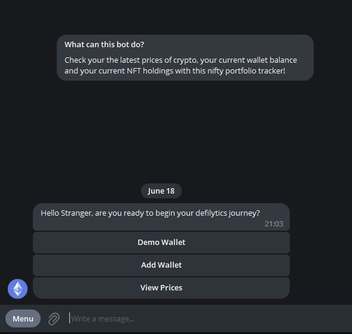

# Defilytics
Check your the latest prices of crypto, your current wallet balance and your current NFT holdings with this nifty portfolio tracker! The telegram bot is live check it out [here](https://t.me/DefilyticsBot)

<ul>
The Project consists of two main parts
<li>A smartcontract containing the price feeds of Ethereum, Bitcoin and USD deployed using hardhat in the "PriceFeeds(hardhat)" Folder</li>
<li>A telegram bot that acts as a portfolio tracker in the "Telegram" Folder</li>
</ul>

How does it all fit together? Well the telegram bot calls two functions in the smartcontract when the user presses View Prices!

# Table of Contents
- [Smart Contract](#smart-contract)
- [Telegram Bot](#telegram-bot)
- [Other Details](#other-details)

## Smart Contract
In this section I will go through some of the details of the smart contract. This is the [transaction hash](https://sepolia.etherscan.io/tx/0x77f1e9513e59de5160a2c2a0a10c6c1ef0b4e548dfe37491369a0aae02055426) when the smart contract was deployed. The contract address is 0x6b80929038568680A6f9Acb8017843f7e2E6A739!

### Functions and Explanation
In the first code block, I am importing the AggregatorV3Interface oracle contract from chainlink to get the price feeds of different cryptocurrencies. I then initialize different price feed variables using their contract addresses on the sepolia tesnet within the constructor.

In the second code block, the function getLatesPrices() calls getLatestPrice() for each cryptocurrency price feed and returns them in a tuple. I also define a pure function to retrieve the names of each cryptocurrency with reference to their position in getLatestPrice(); i.e. the return value of position 0 will give me "Ethereum" from getNames() and its corresponding price in getLatestPrices().

### Set Up
First create a .env file within the PriceFeeds(hardhat) folder as seen below and intialize two environment variables:
1. ALCHEMY_HTTP_URL -> Regsiter for a sepolia tesnet API Token at [Alchemy](https://dashboard.alchemy.com/)
2. PRIVATE_KEY -> Export your private key from your developer wallet (make sure its not your real one)

In the terminal follow these commands:
1. cd PriceFeeds(hardhat)
2. npm install
3. npx hardhat compile
4. npx hardhat run scripts/deploy.js --network sepolia

After which the contract should be deployed!

### Useful Resources
1. [Build your own NFT using ERC-721](https://learnweb3.io/courses/9a3fafe4-b5eb-4329-bdef-97b2aa6aacc1/lessons/017e65bf-2a86-455e-a499-09b61ffa5241)
2. [Getting Started with Hardhat](https://hardhat.org/hardhat-runner/docs/getting-started#overview)
3. [Using Data Feeds on EVM](https://docs.chain.link/data-feeds/using-data-feeds)

## Telegram Bot
In this section I will go through the telegram bot at a glance from the front end. The telegram bot was built using python, for the detailed code breakdown do look through defi.py or reach out to me! Do check out the live bot [here](https://t.me/DefilyticsBot)

### Functions and Explanation

At the start users can choose demo wallet, add wallet and view prices

After pressing demo wallet, the user will be shown the demo wallet address and will be presented with the option to view the current wallet balance, view the wallets NFTs or go back

When the user presses view balance

When the user presses view nfts (he can scroll through using next or previous)

If the user presses add wallet he will be prompted to give a wallet address which will be added to the Bot

If the user presses view prices he will be shown the latest prices of Ethereum, Bitcoin and USDC

### Set Up
First create a .env file within the Telegram folder as seen below and intialize two environment variables:
1. TELE_TOKEN -> Regsiter for a Telegram Token at [Botfather](https://t.me/BotFather)
2. HTTP_ENDPOINT_ETH -> Regsiter for a ethereuem mainnet API Token at [Alchemy](https://dashboard.alchemy.com/)
3. OPENSEA_API -> Follow [this](https://docs.opensea.io/reference/api-keys) guide to register for an Opensea API token
4. WSS_ENDPOINT_SEPOLIA -> Regsiter for a sepolia tesnet API Token at [Alchemy](https://dashboard.alchemy.com/)

In the terminal follow these commands:
1. cd Telegram
2. python -m venv env (creating a python virtual environment so that it is easier to download dependencies)
3. .\env\Scripts\activate
4. pip install -r requirements.txt
5. python defi.py

### Useful Resources
1. [Python Telegram Bot Documentation](https://docs.python-telegram-bot.org/en/stable/)
2. [Chat GPT :)](https://chat.openai.com/)

## Other Details
Will consider making improvements if I have the time to do so. Any questions reach out to me on [linkedIn!](https://www.linkedin.com/in/liam-ayathan-046b3816b/)

